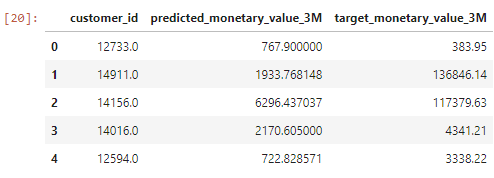
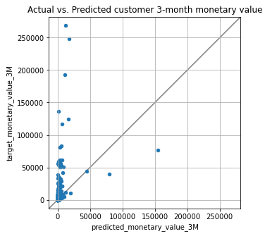
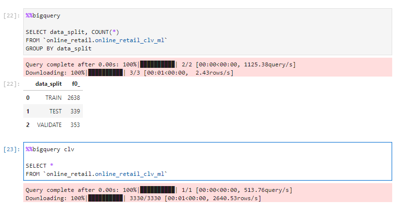
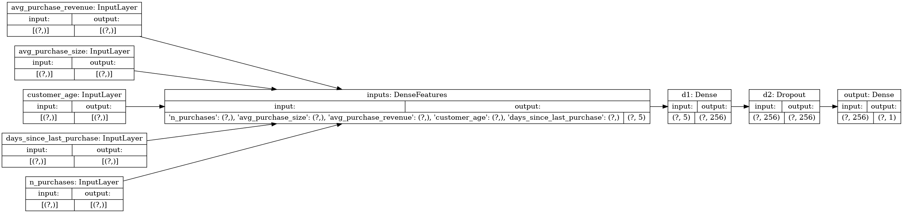
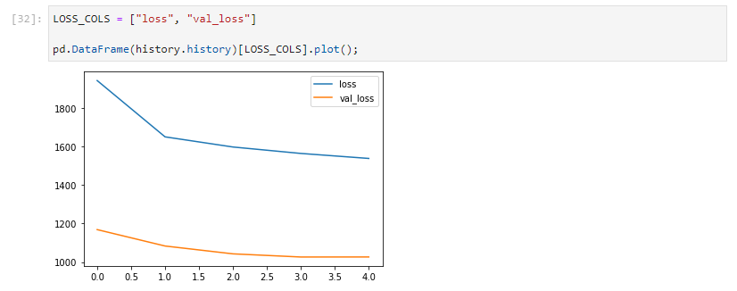
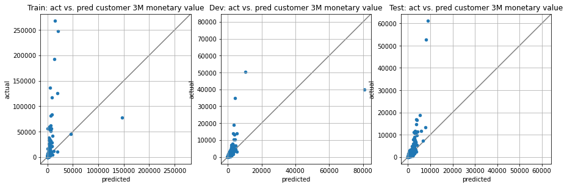
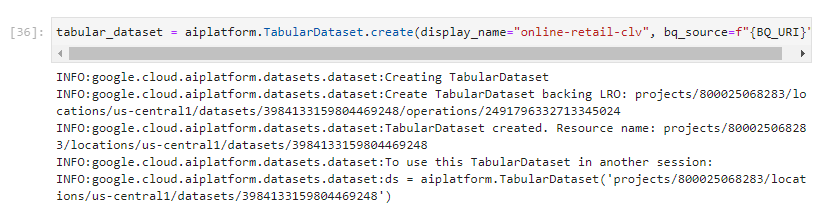
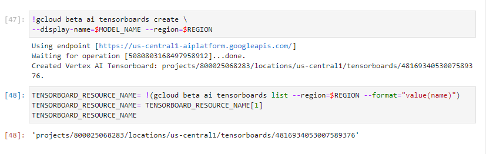
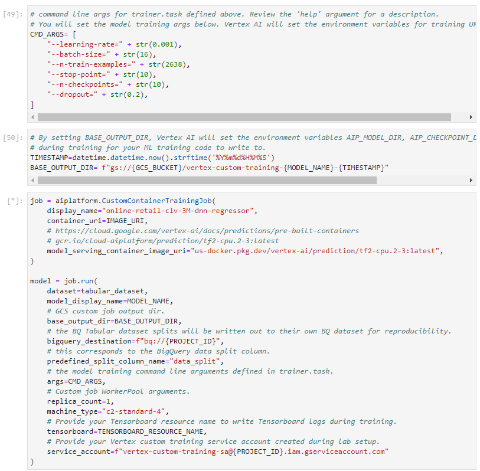

# Vertex AI

---
## 필요한 모든 ML 도구를 갖춘 단일 AI 플랫폼

전체 ML 워크플로를 위한 통합 UI
Vertex AI는 하나의 통합 UI 및 API로 ML을 빌드하기 위해 Google Cloud 서비스를 한곳에 모았습니다. Vertex AI에서는 이제 AutoML 또는 커스텀 코드 학습을 사용하여 모델을 쉽게 학습시키고 비교할 수 있으며 모든 모델이 하나의 중앙 모델 저장소에 저장됩니다. 이제 이러한 모델을 Vertex AI의 동일한 엔드포인트에 배포할 수 있습니다.

비전, 동영상, 자연어 등을 위한 선행 학습된 API
비전, 동영상, 번역, 자연어 ML을 기존 애플리케이션에 간편하게 주입하거나 광범위한 용도(번역 및 음성 텍스트 변환)의 완전히 새로운 지능형 애플리케이션을 빌드할 수 있습니다. AutoML을 사용하면 개발자는 최소한의 ML 전문 지식이나 노력으로 비즈니스 요구에 맞게 고품질 모델을 학습시킬 수 있습니다. 데이터 유형(비전, 자연어, 테이블 형식)의 모든 데이터 세트에 대한 중앙 관리형 레지스트리가 제공됩니다.

데이터 및 AI를 위한 엔드 투 엔드 통합
Vertex AI는 Vertex AI Workbench를 통해 기본적으로 BigQuery, Dataproc, Spark와 통합됩니다. BigQuery ML을 사용하여 기존 비즈니스 인텔리전스 도구 및 스프레드시트에서 표준 SQL 쿼리를 사용하여 BigQuery에서 머신러닝 모델을 만들고 실행할 수 있습니다. 또는 데이터 세트를 BigQuery에서 Vertex AI Workbench로 직접 내보내기하여 해당 위치에서 모델을 실행할 수 있습니다. Vertex Data Labeling을 사용하여 데이터 모음에 대한 라벨을 매우 정확하게 생성할 수 있습니다.

모든 오픈소스 프레임워크 지원
Vertex AI는 TensorFlow, PyTorch, scikit-learn과 같이 널리 사용되는 오픈소스 프레임워크와 통합되며, 학습 및 예측용 커스텀 컨테이너를 통해 모든 ML 프레임워크 및 인공지능 브랜치를 지원합니다.

---
위는 구글에서 제공하고 있는  Vertex AI의 주요 특징이다.


- Vertex AI는 머신러닝 개발을 위한 Google Cloud의 차세대 통합 플랫폼으로써 2021년 5월 Google I/O에서 발표된 AI Platform의 후속 제품이다.
- Vertex AI를 통해 머신러닝 솔루션을 개발하면 최신 ML 사전 구축 구성 요소와 AutoML을 사용하면 개발 생산성, 워크플로를 확장하고 데이터를 사용하여 의사 결정을 내리는 기능, 가치 실현 시간을 단축할 수 있다.

Google Qwik Lab을 통해서 Vertex AI를 진행해보았다.

```sh
# gcloud 서비스 활성화
gcloud services enable \
  compute.googleapis.com \
  iam.googleapis.com \
  iamcredentials.googleapis.com \
  monitoring.googleapis.com \
  logging.googleapis.com \
  notebooks.googleapis.com \
  aiplatform.googleapis.com \
  bigquery.googleapis.com \
  artifactregistry.googleapis.com \
  cloudbuild.googleapis.com \
  container.googleapis.com

# Operation "operations/acat.~~~~" finished successfully.
```

Vertex Tensorboard 통합을 위한 Vertex AI 맞춤형 서비스 계정 생성
```sh

# 1. 서비스 계정 생성
SERVICE_ACCOUNT_ID=vertex-custom-training-sa
gcloud iam service-accounts create $SERVICE_ACCOUNT_ID  \
    --description="A custom service account for Vertex custom training with Tensorboard" \
    --display-name="Vertex AI Custom Training"

# 2. Tensorboard 로그 작성 및 검색을 위해 GCS에 대한 액세스 권한 부여
PROJECT_ID=$(gcloud config get-value core/project)
gcloud projects add-iam-policy-binding $PROJECT_ID \
    --member=serviceAccount:$SERVICE_ACCOUNT_ID@$PROJECT_ID.iam.gserviceaccount.com \
    --role="roles/storage.admin"

# 3. TensorFlow 모델로 데이터를 읽을 수 있도록 BigQuery 데이터 소스에 대한 액세스 권한을 부여
gcloud projects add-iam-policy-binding $PROJECT_ID \
    --member=serviceAccount:$SERVICE_ACCOUNT_ID@$PROJECT_ID.iam.gserviceaccount.com \
    --role="roles/bigquery.admin"

# 4. 모델 교육, 배포 및 설명 작업을 실행하기 위해 Vertex AI에 대한 액세스 권한을 부여
gcloud projects add-iam-policy-binding $PROJECT_ID \
    --member=serviceAccount:$SERVICE_ACCOUNT_ID@$PROJECT_ID.iam.gserviceaccount.com \
    --role="roles/aiplatform.user"
```

그런다음 Google Cloud 메뉴에서 Artificial Intelligence - Vertex AI - Workbench 로 들어가서 새로운 노트북을 생성한다.
그러면 주피터 랩을 실행할 수 있는 하나의 환경이 생성되게 된다. (kubeflow와 매우 유사한것같다.)

실습은 https://github.com/GoogleCloudPlatform/training-data-analyst 의 데이터를 기반으로 진행되었다.

training-data-analyst/self-paced-labs/vertex-ai/vertex-ai-qwikstart/ 로 들어가게되면 Vertex AI 의 스타트 가이드를 볼 수 있다.

또한, 리드미로 가이드도 나와있다.


디렉토리를 `training-data-analyst/self-paced-labs/vertex-ai/vertex-ai-qwikstart/` 로 옮긴이후 
`pip install -U -r requirements.txt` 명령어를 통해서 필요한 종속성을 설치한다.

실습은 UCI Machine Learning Repository에서 공개적으로 사용가능한 온라인 소매 데이터 세트(https://archive.ics.uci.edu/ml/datasets/online+retail)를 사용해서 진행된다.


## 환경변수 및 클라우드 설정과 데이터세트 준비

```Python
# Add installed library dependencies to Python PATH variable.
PATH=%env PATH
%env PATH={PATH}:/home/jupyter/.local/bin

# Retrieve and set PROJECT_ID and REGION environment variables.
PROJECT_ID = !(gcloud config get-value core/project)
PROJECT_ID = PROJECT_ID[0]
REGION = 'us-central1'

# Create a globally unique Google Cloud Storage bucket for artifact storage.
GCS_BUCKET = f"{PROJECT_ID}-bucket"

!gsutil mb -l $REGION gs://$GCS_BUCKET

import os
import datetime
import numpy as np
import pandas as pd
import tensorflow as tf
import matplotlib.pyplot as plt

from google.cloud import aiplatform

aiplatform.init(project=PROJECT_ID, location=REGION, staging_bucket=f"gs://{GCS_BUCKET}")

# BigQuery constants. Please leave these unchanged.
BQ_DATASET_NAME="online_retail"
BQ_RAW_TABLE_NAME="online_retail_clv_raw"
BQ_CLEAN_TABLE_NAME="online_retail_clv_clean"
BQ_ML_TABLE_NAME="online_retail_clv_ml"
BQ_URI=f"bq://{PROJECT_ID}.{BQ_DATASET_NAME}.{BQ_ML_TABLE_NAME}"

!python utils/data_download.py \
  --PROJECT_ID={PROJECT_ID} \
  --GCS_BUCKET={GCS_BUCKET} \
  --BQ_RAW_TABLE_NAME={BQ_RAW_TABLE_NAME} \
  --BQ_CLEAN_TABLE_NAME={BQ_CLEAN_TABLE_NAME} \
  --BQ_ML_TABLE_NAME={BQ_ML_TABLE_NAME} \
  --URL="https://archive.ics.uci.edu/ml/machine-learning-databases/00352/Online Retail.xlsx"
```

엑셀파일을 다운로드받게되고 csv 파일로 변환한다.

## 데이터 전처리

데이터에 대한 사전처리를 진행한다.
고객 ID가 있는 데이터만, 송장에서 일별로 집계하고, 긍정적인 주문과 금전적으로 가치가 있는 데이터만, 고객 ID별로 집계하고 최근성, 빈도, 금전적 특성 및 예측 대상을 계산

각 컬럼은 다음과 같다.
- customer_country(카테고리): 고객 구매 국가
- n_purchases(숫자): 기능 창에서 이루어진 구매 수 (빈도)
- avg_purchase_size(숫자): 기능 창의 평균 단위 구매 수. (통화의)
- avg_purchase_revenue(숫자): 기능 창에서 평균 GBP 구매 금액 (통화의)
- customer_age(숫자): 기능 창에서 첫 구매 후 일수
- days_since_last_purchase(숫자): 기능 창에서 가장 최근에 구매한 날로부터의 일 (최신)

레이블은 다음과 같다.
- target_monetary_value_3M(숫자): 기능 및 예측 기간을 포함한 전체 연구 기간의 고객 수익

## BigQuery를 이용한 데이터 분석

이 실습은 빅쿼리를 통한 데이터 분석이 이루어진다.

.png)

분석결과 : 차트에는 지난 며칠 동안 구매한 충성도가 높은 고객과 250일 이상 구매하지 않은 비활성 고객과 같이 분명히 몇 가지 다른 고객 그룹이 있습니다. CLV 예측 및 통찰력을 사용하여 마케팅 및 판촉 개입에 대한 전략을 세워 고객 구매 최신성 및 반응성 휴면 고객을 개선할 수 있습니다.

이후, 마찬가지로 빅쿼리를 이용해 빈도를 분석한다.


분석결과 : 차트와 분위수에서 절반의 고객이 2개 이하의 구매를 하고 있음을 알 수 있습니다. 또한 평균 구매 > 중간 구매 및 최대 구매 81개에서 훨씬 더 많은 구매를 한 고객(도매업자일 가능성이 있음)이 있음을 알 수 있습니다. 이것은 구매를 버킷화하고 이상치 고객을 제거하거나 클리핑하는 것과 같은 기능 엔지니어링 기회에 대해 이미 생각하고 있어야 합니다. 또한 이 랩에서 시연한 접근 방식이 관계 거래 내역이 더 많은 고객에게 더 나은 성능을 발휘하므로 단 한 번만 구매한 신규 고객에 대한 CLV에 대한 대체 모델링 전략을 탐색할 수도 있습니다.

다음에는 빅쿼리를 이용해 지출하는 비용의 양을 측정한다.


분석결과 : 차트 및 요약 통계에서 고객의 금전적 가치가 2.90에서 268,478GBP까지 다양함을 알 수 있습니다. 분위수를 보면 금전적 가치가 평균에서 3 표준 편차보다 큰 소수의 이상치 고객이 있음이 분명합니다. 이 작은 데이터 세트를 사용하면 이러한 이상치 고객 값을 제거하여 별도로 처리하고, 이상치에 더 강한 모델의 손실 함수를 변경하거나, 대상 기능을 기록하거나, 해당 값을 최대 임계값으로 자르는 것이 좋습니다. 또한 CLV 비즈니스 요구 사항을 다시 방문하여 고객의 금전적 가치를 비닝하고 이를 ML 분류 문제로 재구성하는 것이 요구 사항에 적합한지 확인해야 합니다.

## 간단한 모델 성능 기준 설정 

평균 구매 금액 * 일일 평균 구매 수량을 통해 간닪나 수식으로 성능 기준을 회귀를 통해 설정한다.

``` SQL
%%bigquery

WITH
  day_intervals AS (
  SELECT
      customer_id,
      DATE_DIFF(DATE('2011-12-01'), DATE('2011-09-01'), DAY) AS target_days,
      DATE_DIFF(DATE('2011-09-01'), MIN(order_date), DAY) AS feature_days,
  FROM
    `online_retail.online_retail_clv_clean`
  GROUP BY
      customer_id
  ),
    
  predicted_clv AS (
  SELECT
      customer_id,
      AVG(avg_purchase_revenue) * (COUNT(n_purchases) * (1 + SAFE_DIVIDE(COUNT(target_days),COUNT(feature_days)))) AS predicted_monetary_value_3M,
      SUM(target_monetary_value_3M) AS target_monetary_value_3M
  FROM
    `online_retail.online_retail_clv_ml`
  LEFT JOIN day_intervals USING(customer_id)
  GROUP BY
      customer_id
  )

# Calculate overall baseline regression metrics.
SELECT
  ROUND(AVG(ABS(predicted_monetary_value_3M - target_monetary_value_3M)), 2) AS MAE,
  ROUND(AVG(POW(predicted_monetary_value_3M - target_monetary_value_3M, 2)), 2) AS MSE,
  ROUND(SQRT(AVG(POW(predicted_monetary_value_3M - target_monetary_value_3M, 2))), 2) AS RMSE
FROM
  predicted_clv
```


MSE를 보면 매우 큰데, 이러한 기준은 이상값에 강한 영향을 받게 되어서 그런경우가 많다. 기준결과를 그래프를 통해서 확인한다.


```SQL
%%bigquery baseline

WITH
  day_intervals AS (
  SELECT
      customer_id,
      DATE_DIFF(DATE('2011-12-01'), DATE('2011-09-01'), DAY) AS target_days,
      DATE_DIFF(DATE('2011-09-01'), MIN(order_date), DAY) AS feature_days,
  FROM
    `online_retail.online_retail_clv_clean`
  GROUP BY
      customer_id
  ),
    
  predicted_clv AS (
  SELECT
      customer_id,
      AVG(avg_purchase_revenue) * (COUNT(n_purchases) * (1 + SAFE_DIVIDE(COUNT(target_days),COUNT(feature_days)))) AS predicted_monetary_value_3M,
      SUM(target_monetary_value_3M) AS target_monetary_value_3M
  FROM
    `online_retail.online_retail_clv_ml`
  INNER JOIN day_intervals USING(customer_id)
  GROUP BY
      customer_id
  )

SELECT
 *
FROM
  predicted_clv

baseline.head()
```


```Python
ax = baseline.plot(kind='scatter',
                   x='predicted_monetary_value_3M', 
                   y='target_monetary_value_3M',
                   title='Actual vs. Predicted customer 3-month monetary value',
                   figsize=(5,5),
                   grid=True)

lims = [
    np.min([ax.get_xlim(), ax.get_ylim()]),  # min of both axes
    np.max([ax.get_xlim(), ax.get_ylim()]),  # max of both axes
]

# now plot both limits against eachother
ax.plot(lims, lims, 'k-', alpha=0.5, zorder=0)
ax.set_aspect('equal')
ax.set_xlim(lims)
ax.set_ylim(lims);
```


결과를 보면 이상하게 높은 값을 몇개가 있다. 아마 저러한 outlier 때문에 오차가 측정되는 것 같다.

이후 Tensorflow를 이용해서 훈련을 진행한다.

```SQL
%%bigquery

SELECT data_split, COUNT(*)
FROM `online_retail.online_retail_clv_ml`
GROUP BY data_split

%%bigquery clv

SELECT *
FROM `online_retail.online_retail_clv_ml`
```



모델 빌드

```Python
clv_train = clv.loc[clv.data_split == 'TRAIN', :]
clv_dev = clv.loc[clv.data_split == 'VALIDATE', :]
clv_test = clv.loc[clv.data_split == 'TEST', :]

# Model training constants.
# Virtual epochs design pattern:
# https://medium.com/google-cloud/ml-design-pattern-3-virtual-epochs-f842296de730
N_TRAIN_EXAMPLES = 2638
STOP_POINT = 20.0
TOTAL_TRAIN_EXAMPLES = int(STOP_POINT * N_TRAIN_EXAMPLES)
BATCH_SIZE = 32
N_CHECKPOINTS = 10
STEPS_PER_EPOCH = (TOTAL_TRAIN_EXAMPLES // (BATCH_SIZE*N_CHECKPOINTS))

NUMERIC_FEATURES = [
    "n_purchases",
    "avg_purchase_size",
    "avg_purchase_revenue",
    "customer_age",
    "days_since_last_purchase",
]

LABEL = "target_monetary_value_3M"

# Model training constants.
# Virtual epochs design pattern:
# https://medium.com/google-cloud/ml-design-pattern-3-virtual-epochs-f842296de730
N_TRAIN_EXAMPLES = 2638
STOP_POINT = 20.0
TOTAL_TRAIN_EXAMPLES = int(STOP_POINT * N_TRAIN_EXAMPLES)
BATCH_SIZE = 32
N_CHECKPOINTS = 10
STEPS_PER_EPOCH = (TOTAL_TRAIN_EXAMPLES // (BATCH_SIZE*N_CHECKPOINTS))

NUMERIC_FEATURES = [
    "n_purchases",
    "avg_purchase_size",
    "avg_purchase_revenue",
    "customer_age",
    "days_since_last_purchase",
]

LABEL = "target_monetary_value_3M"

def df_dataset(df):
    """Transform Pandas Dataframe to TensorFlow Dataset."""
    return tf.data.Dataset.from_tensor_slices((df[NUMERIC_FEATURES].to_dict('list'), df[LABEL].values))

trainds = df_dataset(clv_train).prefetch(1).batch(BATCH_SIZE).repeat()
devds = df_dataset(clv_dev).prefetch(1).batch(BATCH_SIZE)
testds = df_dataset(clv_test).prefetch(1).batch(BATCH_SIZE)

def rmse(y_true, y_pred):
    """Custom RMSE regression metric."""
    return tf.sqrt(tf.reduce_mean(tf.square(y_pred - y_true)))


def build_model():
    """Build and compile a TensorFlow Keras Regressor."""
    # Define input feature tensors and input layers.
    feature_columns = [
        tf.feature_column.numeric_column(key=feature)
        for feature in NUMERIC_FEATURES
    ]
    
    input_layers = {
        feature.key: tf.keras.layers.Input(name=feature.key, shape=(), dtype=tf.float32)
        for feature in feature_columns
    }
     
    # Keras Functional API: https://keras.io/guides/functional_api
    inputs = tf.keras.layers.DenseFeatures(feature_columns, name='inputs')(input_layers)
    d1 = tf.keras.layers.Dense(256, activation=tf.nn.relu, name='d1')(inputs)
    d2 = tf.keras.layers.Dropout(0.2, name='d2')(d1)  
    # Note: the single neuron output for regression.
    output = tf.keras.layers.Dense(1, name='output')(d2)
    
    model = tf.keras.Model(input_layers, output, name='online-retail-clv')
    
    optimizer = tf.keras.optimizers.Adam(0.001)    
    
    # Note: MAE loss is more resistant to outliers than MSE.
    model.compile(loss=tf.keras.losses.MAE,
                  optimizer=optimizer,
                  metrics=[['mae', 'mse', rmse]])
    
    return model

model = build_model()
```

plot을 통한 모델 확인
`tf.keras.utils.plot_model(model, show_shapes=True, rankdir="LR")`


모델 옵션 설정 및 학습
```Python
tensorboard_callback = tf.keras.callbacks.TensorBoard(
    log_dir='./local-training/tensorboard',
    histogram_freq=1)

earlystopping_callback = tf.keras.callbacks.EarlyStopping(patience=1)

checkpoint_callback = tf.keras.callbacks.ModelCheckpoint(
    filepath='./local-training/checkpoints',
    save_weights_only=True,
    monitor='val_loss',
    mode='min')

history = model.fit(trainds,
                    validation_data=devds,
                    steps_per_epoch=STEPS_PER_EPOCH,
                    epochs=N_CHECKPOINTS,
                    callbacks=[[tensorboard_callback,
                                earlystopping_callback,
                                checkpoint_callback]])
```
Output :
```text
Epoch 1/10
  1/164 [..............................] - ETA: 0s - loss: 10647.6670 - mae: 10647.6670 - mse: 376927808.0000 - rmse: 19414.6289WARNING:tensorflow:From /opt/conda/lib/python3.7/site-packages/tensorflow/python/ops/summary_ops_v2.py:1277: stop (from tensorflow.python.eager.profiler) is deprecated and will be removed after 2020-07-01.
Instructions for updating:
use `tf.profiler.experimental.stop` instead.
WARNING:tensorflow:From /opt/conda/lib/python3.7/site-packages/tensorflow/python/ops/summary_ops_v2.py:1277: stop (from tensorflow.python.eager.profiler) is deprecated and will be removed after 2020-07-01.
Instructions for updating:
use `tf.profiler.experimental.stop` instead.
  2/164 [..............................] - ETA: 5s - loss: 10569.2812 - mae: 10569.2812 - mse: 729423360.0000 - rmse: 26153.5820WARNING:tensorflow:Callbacks method `on_train_batch_end` is slow compared to the batch time (batch time: 0.0222s vs `on_train_batch_end` time: 0.0488s). Check your callbacks.
WARNING:tensorflow:Callbacks method `on_train_batch_end` is slow compared to the batch time (batch time: 0.0222s vs `on_train_batch_end` time: 0.0488s). Check your callbacks.
 24/164 [===>..........................] - ETA: 1s - loss: 4502.0854 - mae: 4502.0854 - mse: 275203264.0000 - rmse: 11308.6211
2022-06-29 17:30:47.754527: I tensorflow/core/profiler/lib/profiler_session.cc:164] Profiler session started.
2022-06-29 17:30:47.803583: I tensorflow/core/profiler/rpc/client/save_profile.cc:176] Creating directory: ./local-training/tensorboard/train/plugins/profile/2022_06_29_17_30_47
2022-06-29 17:30:47.805333: I tensorflow/core/profiler/rpc/client/save_profile.cc:182] Dumped gzipped tool data for trace.json.gz to ./local-training/tensorboard/train/plugins/profile/2022_06_29_17_30_47/tensorflow-2-3-20220630-012840.trace.json.gz
2022-06-29 17:30:47.819277: I tensorflow/core/profiler/rpc/client/save_profile.cc:176] Creating directory: ./local-training/tensorboard/train/plugins/profile/2022_06_29_17_30_47
2022-06-29 17:30:47.819602: I tensorflow/core/profiler/rpc/client/save_profile.cc:182] Dumped gzipped tool data for memory_profile.json.gz to ./local-training/tensorboard/train/plugins/profile/2022_06_29_17_30_47/tensorflow-2-3-20220630-012840.memory_profile.json.gz
2022-06-29 17:30:47.819954: I tensorflow/python/profiler/internal/profiler_wrapper.cc:111] Creating directory: ./local-training/tensorboard/train/plugins/profile/2022_06_29_17_30_47Dumped tool data for xplane.pb to ./local-training/tensorboard/train/plugins/profile/2022_06_29_17_30_47/tensorflow-2-3-20220630-012840.xplane.pb
Dumped tool data for overview_page.pb to ./local-training/tensorboard/train/plugins/profile/2022_06_29_17_30_47/tensorflow-2-3-20220630-012840.overview_page.pb
Dumped tool data for input_pipeline.pb to ./local-training/tensorboard/train/plugins/profile/2022_06_29_17_30_47/tensorflow-2-3-20220630-012840.input_pipeline.pb
Dumped tool data for tensorflow_stats.pb to ./local-training/tensorboard/train/plugins/profile/2022_06_29_17_30_47/tensorflow-2-3-20220630-012840.tensorflow_stats.pb
Dumped tool data for kernel_stats.pb to ./local-training/tensorboard/train/plugins/profile/2022_06_29_17_30_47/tensorflow-2-3-20220630-012840.kernel_stats.pb

164/164 [==============================] - 1s 7ms/step - loss: 1941.0304 - mae: 1941.0304 - mse: 105081872.0000 - rmse: 4964.3975 - val_loss: 1168.0652 - val_mae: 1168.0652 - val_mse: 12915857.0000 - val_rmse: 2345.9702
Epoch 2/10
164/164 [==============================] - 1s 4ms/step - loss: 1649.0674 - mae: 1649.0674 - mse: 96765472.0000 - rmse: 4544.3818 - val_loss: 1083.0311 - val_mae: 1083.0311 - val_mse: 12694469.0000 - val_rmse: 2323.2122
Epoch 3/10
164/164 [==============================] - 1s 5ms/step - loss: 1596.4434 - mae: 1596.4434 - mse: 96140792.0000 - rmse: 4511.0894 - val_loss: 1042.3643 - val_mae: 1042.3643 - val_mse: 13052742.0000 - val_rmse: 2337.3381
Epoch 4/10
164/164 [==============================] - 1s 5ms/step - loss: 1563.0726 - mae: 1563.0726 - mse: 95198904.0000 - rmse: 4460.5347 - val_loss: 1026.0037 - val_mae: 1026.0037 - val_mse: 13189355.0000 - val_rmse: 2339.1282
Epoch 5/10
164/164 [==============================] - 1s 5ms/step - loss: 1537.1716 - mae: 1537.1716 - mse: 93191048.0000 - rmse: 4361.7192 - val_loss: 1026.2231 - val_mae: 1026.2231 - val_mse: 14458404.0000 - val_rmse: 2412.5261
```

epoch 5회에서 early stopping이 일어났다.



```Python
train_pred = model.predict(df_dataset(clv_train).prefetch(1).batch(BATCH_SIZE))
dev_pred = model.predict(devds)
test_pred = model.predict(testds)

train_results = pd.DataFrame({'actual': clv_train['target_monetary_value_3M'].to_numpy(), 'predicted': np.squeeze(train_pred)}, columns=['actual', 'predicted'])
dev_results = pd.DataFrame({'actual': clv_dev['target_monetary_value_3M'].to_numpy(), 'predicted': np.squeeze(dev_pred)}, columns=['actual', 'predicted'])
test_results = pd.DataFrame({'actual': clv_test['target_monetary_value_3M'].to_numpy(), 'predicted': np.squeeze(test_pred)}, columns=['actual', 'predicted'])

# Model prediction calibration plots.
fig, (train_ax, dev_ax, test_ax) = plt.subplots(1, 3, figsize=(15,15))

train_results.plot(kind='scatter',
                  x='predicted',
                  y='actual',
                  title='Train: act vs. pred customer 3M monetary value',
                  grid=True,
                  ax=train_ax)

train_lims = [
    np.min([train_ax.get_xlim(), train_ax.get_ylim()]),  # min of both axes
    np.max([train_ax.get_xlim(), train_ax.get_ylim()]),  # max of both axes
]

train_ax.plot(train_lims, train_lims, 'k-', alpha=0.5, zorder=0)
train_ax.set_aspect('equal')
train_ax.set_xlim(train_lims)
train_ax.set_ylim(train_lims)

dev_results.plot(kind='scatter',
                  x='predicted',
                  y='actual',
                  title='Dev: act vs. pred customer 3M monetary value',
                  grid=True,
                  ax=dev_ax)

dev_lims = [
    np.min([dev_ax.get_xlim(), dev_ax.get_ylim()]),  # min of both axes
    np.max([dev_ax.get_xlim(), dev_ax.get_ylim()]),  # max of both axes
]

dev_ax.plot(dev_lims, dev_lims, 'k-', alpha=0.5, zorder=0)
dev_ax.set_aspect('equal')
dev_ax.set_xlim(dev_lims)
dev_ax.set_ylim(dev_lims)

test_results.plot(kind='scatter',
                  x='predicted',
                  y='actual',
                  title='Test: act vs. pred customer 3M monetary value',
                  grid=True,
                  ax=test_ax)

test_lims = [
    np.min([test_ax.get_xlim(), test_ax.get_ylim()]),  # min of both axes
    np.max([test_ax.get_xlim(), test_ax.get_ylim()]),  # max of both axes
]

test_ax.plot(test_lims, test_lims, 'k-', alpha=0.5, zorder=0)
test_ax.set_aspect('equal')
test_ax.set_xlim(test_lims)
test_ax.set_ylim(test_lims);
```


처음에 설정했던 baseline 보다는 잘 학습된것을 확인할 수 있었다.

이제 Vertex AI를 사용하여 이 TensorFlow 워크플로를 클라우드로 가져오는 과정을 살펴본다.

## Bigquery를 통해 데이터 소스에서 관리형 테이블 형식 데이터 셋 만들기

BigQuery에 저장된 이 실습 데이터세트의 공유 및 메타데이터를 관리하기 위한 테이블 형식 회귀 데이터세트 를 만듭니다 . 관리형 데이터 세트를 사용하면 데이터와 맞춤형 학습 모델 간의 명확한 링크를 생성하고 기술 통계와 자동 또는 수동 분할을 학습, 테스트 및 검증 세트로 분할할 수 있습니다.




## Vertex AI 사용자 지정 ML 모델 교육 워크플로우 만들기

1. `model.py` 훈련 스크립트 만들기
```Python
# this is the name of your model subdirectory you will write your model code to. It is already created in your lab directory.
MODEL_NAME="online-retail-clv-3M"

%%writefile {MODEL_NAME}/trainer/model.py
import os
import logging
import tempfile
import tensorflow as tf
from explainable_ai_sdk.metadata.tf.v2 import SavedModelMetadataBuilder
from tensorflow.python.framework import dtypes
from tensorflow_io.bigquery import BigQueryClient
from tensorflow_io.bigquery import BigQueryReadSession


# Model feature constants.
NUMERIC_FEATURES = [
    "n_purchases",
    "avg_purchase_size",
    "avg_purchase_revenue",
    "customer_age",
    "days_since_last_purchase",
]

CATEGORICAL_FEATURES = [
    "customer_country"
]

LABEL = "target_monetary_value_3M"


def caip_uri_to_fields(uri):
    """Helper function to parse BQ URI."""
    # Remove bq:// prefix.
    uri = uri[5:]
    project, dataset, table = uri.split('.')
    return project, dataset, table


def features_and_labels(row_data):
    """Helper feature and label mapping function for tf.data."""
    label = row_data.pop(LABEL)
    features = row_data
    return features, label


def read_bigquery(project, dataset, table):
    """TensorFlow IO BigQuery Reader."""
    tensorflow_io_bigquery_client = BigQueryClient()
    read_session = tensorflow_io_bigquery_client.read_session(
      parent="projects/" + project,
      project_id=project, 
      dataset_id=dataset,
      table_id=table,
      # Pass list of features and label to be selected from BQ.
      selected_fields=NUMERIC_FEATURES + [LABEL],
      # Provide output TensorFlow data types for features and label.
      output_types=[dtypes.int64, dtypes.float64, dtypes.float64, dtypes.int64, dtypes.int64] + [dtypes.float64],
      requested_streams=2)
    dataset = read_session.parallel_read_rows()
    transformed_ds = dataset.map(features_and_labels)
    return transformed_ds


def rmse(y_true, y_pred):
    """Custom RMSE regression metric."""
    return tf.sqrt(tf.reduce_mean(tf.square(y_pred - y_true)))


def build_model(hparams):
    """Build and compile a TensorFlow Keras DNN Regressor."""

    feature_columns = [
        tf.feature_column.numeric_column(key=feature)
        for feature in NUMERIC_FEATURES
    ]
    
    input_layers = {
        feature.key: tf.keras.layers.Input(name=feature.key, shape=(), dtype=tf.float32)
        for feature in feature_columns
    }
    # Keras Functional API: https://keras.io/guides/functional_api
    inputs = tf.keras.layers.DenseFeatures(feature_columns, name='inputs')(input_layers)
    d1 = tf.keras.layers.Dense(256, activation=tf.nn.relu, name='d1')(inputs)
    d2 = tf.keras.layers.Dropout(hparams['dropout'], name='d2')(d1)    
    # Note: a single neuron scalar output for regression.
    output = tf.keras.layers.Dense(1, name='output')(d2)
    
    model = tf.keras.Model(input_layers, output, name='online-retail-clv')
    
    optimizer = tf.keras.optimizers.Adam(hparams['learning-rate'])    
    
    # Note: MAE loss is more resistant to outliers than MSE.
    model.compile(loss=tf.keras.losses.MAE,
                  optimizer=optimizer,
                  metrics=[['mae', 'mse', rmse]])
    
    return model


def train_evaluate_explain_model(hparams):
    """Train, evaluate, explain TensorFlow Keras DNN Regressor.
    Args:
      hparams(dict): A dictionary containing model training arguments.
    Returns:
      history(tf.keras.callbacks.History): Keras callback that records training event history.
    """
    training_ds = read_bigquery(*caip_uri_to_fields(hparams['training-data-uri'])).prefetch(1).shuffle(hparams['batch-size']*10).batch(hparams['batch-size']).repeat()
    eval_ds = read_bigquery(*caip_uri_to_fields(hparams['validation-data-uri'])).prefetch(1).shuffle(hparams['batch-size']*10).batch(hparams['batch-size'])
    test_ds = read_bigquery(*caip_uri_to_fields(hparams['test-data-uri'])).prefetch(1).shuffle(hparams['batch-size']*10).batch(hparams['batch-size'])
    
    model = build_model(hparams)
    logging.info(model.summary())
    
    tensorboard_callback = tf.keras.callbacks.TensorBoard(
        log_dir=hparams['tensorboard-dir'],
        histogram_freq=1)
    
    # Reduce overfitting and shorten training times.
    earlystopping_callback = tf.keras.callbacks.EarlyStopping(patience=2)
    
    # Ensure your training job's resilience to VM restarts.
    checkpoint_callback = tf.keras.callbacks.ModelCheckpoint(
        filepath= hparams['checkpoint-dir'],
        save_weights_only=True,
        monitor='val_loss',
        mode='min')
    
    # Virtual epochs design pattern:
    # https://medium.com/google-cloud/ml-design-pattern-3-virtual-epochs-f842296de730
    TOTAL_TRAIN_EXAMPLES = int(hparams['stop-point'] * hparams['n-train-examples'])
    STEPS_PER_EPOCH = (TOTAL_TRAIN_EXAMPLES // (hparams['batch-size']*hparams['n-checkpoints']))    
    
    history = model.fit(training_ds,
                        validation_data=eval_ds,
                        steps_per_epoch=STEPS_PER_EPOCH,
                        epochs=hparams['n-checkpoints'],
                        callbacks=[[tensorboard_callback,
                                    earlystopping_callback,
                                    checkpoint_callback]])
    
    logging.info(model.evaluate(test_ds))
    
    # Create a temp directory to save intermediate TF SavedModel prior to Explainable metadata creation.
    tmpdir = tempfile.mkdtemp()
    
    # Export Keras model in TensorFlow SavedModel format.
    model.save(tmpdir)
    
    # Annotate and save TensorFlow SavedModel with Explainable metadata to GCS.
    builder = SavedModelMetadataBuilder(tmpdir)
    builder.save_model_with_metadata(hparams['model-dir'])
    
    return history
```
모델 데이터셋처리, 모델 시퀀스, 옵션 등 학습에 관한 전반적인 내용에 대해 정의한다.

2. `task.py`사용자 지정 ML 모델 컨테이너에 대한 진입점으로 파일 쓰기
```Python
%%writefile {MODEL_NAME}/trainer/task.py
import os
import argparse

from trainer import model

if __name__ == '__main__':
    parser = argparse.ArgumentParser()
    # Vertex custom container training args. These are set by Vertex AI during training but can also be overwritten.
    parser.add_argument('--model-dir', dest='model-dir',
                        default=os.environ['AIP_MODEL_DIR'], type=str, help='Model dir.')
    parser.add_argument('--checkpoint-dir', dest='checkpoint-dir',
                        default=os.environ['AIP_CHECKPOINT_DIR'], type=str, help='Checkpoint dir set during Vertex AI training.')    
    parser.add_argument('--tensorboard-dir', dest='tensorboard-dir',
                        default=os.environ['AIP_TENSORBOARD_LOG_DIR'], type=str, help='Tensorboard dir set during Vertex AI training.')    
    parser.add_argument('--data-format', dest='data-format',
                        default=os.environ['AIP_DATA_FORMAT'], type=str, help="Tabular data format set during Vertex AI training. E.g.'csv', 'bigquery'")
    parser.add_argument('--training-data-uri', dest='training-data-uri',
                        default=os.environ['AIP_TRAINING_DATA_URI'], type=str, help='Training data GCS or BQ URI set during Vertex AI training.')
    parser.add_argument('--validation-data-uri', dest='validation-data-uri',
                        default=os.environ['AIP_VALIDATION_DATA_URI'], type=str, help='Validation data GCS or BQ URI set during Vertex AI training.')
    parser.add_argument('--test-data-uri', dest='test-data-uri',
                        default=os.environ['AIP_TEST_DATA_URI'], type=str, help='Test data GCS or BQ URI set during Vertex AI training.')
    # Model training args.
    parser.add_argument('--learning-rate', dest='learning-rate', default=0.001, type=float, help='Learning rate for optimizer.')
    parser.add_argument('--dropout', dest='dropout', default=0.2, type=float, help='Float percentage of DNN nodes [0,1] to drop for regularization.')    
    parser.add_argument('--batch-size', dest='batch-size', default=16, type=int, help='Number of examples during each training iteration.')    
    parser.add_argument('--n-train-examples', dest='n-train-examples', default=2638, type=int, help='Number of examples to train on.')
    parser.add_argument('--stop-point', dest='stop-point', default=10, type=int, help='Number of passes through the dataset during training to achieve convergence.')
    parser.add_argument('--n-checkpoints', dest='n-checkpoints', default=10, type=int, help='Number of model checkpoints to save during training.')
    
    args = parser.parse_args()
    hparams = args.__dict__

    model.train_evaluate_explain_model(hparams)
```
각종 컨테이너 옵션을 만든다.

3. 커스텀 ML 모델 컨테이너를 위한 Dockerfile 작성
```Javascript
%%writefile {MODEL_NAME}/Dockerfile
# Specifies base image and tag.
# https://cloud.google.com/vertex-ai/docs/general/deep-learning
# https://cloud.google.com/deep-learning-containers/docs/choosing-container
FROM gcr.io/deeplearning-platform-release/tf2-cpu.2-3

# Sets the container working directory.
WORKDIR /root

# Copies the requirements.txt into the container to reduce network calls.
COPY requirements.txt .
# Installs additional packages.
RUN pip3 install -U -r requirements.txt

# Copies the trainer code to the docker image.
COPY . /trainer

# Sets the container working directory.
WORKDIR /trainer

# Sets up the entry point to invoke the trainer.
ENTRYPOINT ["python", "-m", "trainer.task"]
```
학습을 진행하는 도커 컨테이너를 만드는 도커파일을 명시했다

4. `requirements.txt`추가 ML 코드 종속성을 지정하는 파일 작성
```sh
%%writefile {MODEL_NAME}/requirements.txt
explainable-ai-sdk==1.3.0
tensorflow-io==0.15.0
pyarrow
```
필요한 파이썬 종속성을 명시하고 설치하도록 진행한다.

5. Cloud Build를 사용하여 컨테이너를 빌드하고 Google Cloud Artifact Registry에 제출 
```sh
ARTIFACT_REPOSITORY="online-retail-clv"

# Create an Artifact Repository using the gcloud CLI.
!gcloud artifacts repositories create $ARTIFACT_REPOSITORY \
--repository-format=docker \
--location=$REGION \
--description="Artifact registry for ML custom training images for predictive CLV"

# create cloud.build.yaml
IMAGE_NAME="dnn-regressor"
IMAGE_TAG="latest"
IMAGE_URI=f"{REGION}-docker.pkg.dev/{PROJECT_ID}/{ARTIFACT_REPOSITORY}/{IMAGE_NAME}:{IMAGE_TAG}"

cloudbuild_yaml = f"""steps:
- name: 'gcr.io/cloud-builders/docker'
  args: [ 'build', '-t', '{IMAGE_URI}', '.' ]
images: 
- '{IMAGE_URI}'"""

with open(f"{MODEL_NAME}/cloudbuild.yaml", "w") as fp:
    fp.write(cloudbuild_yaml)

!gcloud builds submit --timeout=20m --config {MODEL_NAME}/cloudbuild.yaml {MODEL_NAME}
```
만든 도커파일을 빌드해서 Artifact Repository 에 보내는 과정이다.

이렇게 하면 모델 학습을 위한 준비는 완료된다.

## Vertex AI에서 사용자 지정 훈련 작업 실행하기

1. 모델 실험을 추적하기 위한 Vertex Tensorboard 인스턴스 생성

Vertex TensorBoard를 통해서 훈련 결과를 확인한다.




2. 커스텀 컨테이너 트레이닝 작업 실행 

클래스를 사용 CustomTrainingJob하여 사용자 정의 컨테이너 교육과 관련된 다음 매개변수를 사용하는 작업을 정의합니다.

- display_name: 이 교육 파이프라인의 사용자 정의 이름입니다.
- container_uri: 사용자 지정 학습 컨테이너 이미지의 URI입니다.
- model_serving_container_image_uri: 모델에 대한 예측을 제공할 수 있는 컨테이너의 URI입니다. Vertex 사전 빌드 컨테이너를 사용합니다.
함수를 사용 run()하여 다음 매개변수를 사용하는 훈련을 시작합니다.
- replica_count: 작업자 복제본의 수입니다.
- model_display_name: 스크립트가 관리되는 모델을 생성하는 경우 모델의 표시 이름입니다.
- machine_type: 훈련에 사용할 기계의 유형입니다.
- bigquery_destination: 생성된 테이블 형식 데이터세트가 작성되는 BigQuery URI입니다.
- predefined_split_column_name: 이 실습에서는 데이터 처리 및 분할에 BigQuery를 활용했으므로 이 열은 데이터 분할을 나타내기 위해 지정됩니다.
Modelrun 함수는 Vertex 객체 를 훈련하고 생성하는 훈련 파이프라인을 생성 합니다. 

훈련 파이프라인이 완료되면 run()함수가 Model객체를 반환합니다.



3. Vertex TensorBoard로 모델 훈련 성능 검사


## Vertex AI Prediction으로 모델 제공: 온라인 모델 예측 및 설명

1. 설명 메타데이터 및 매개변수 작성 