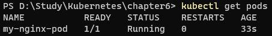
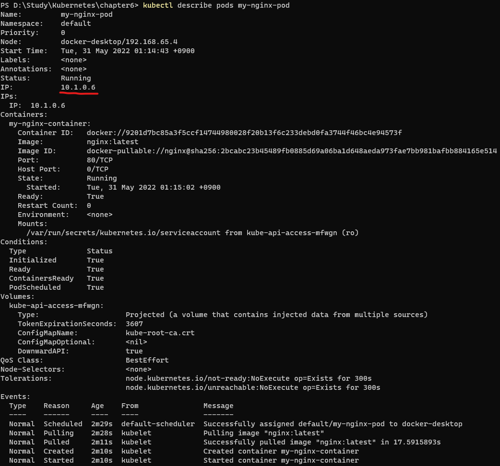
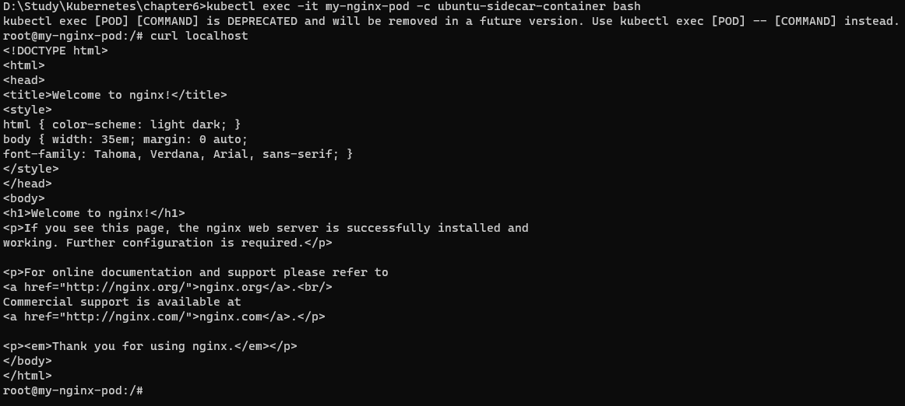

## Pod (팟)
Pod은 도커에서의 컨테이너, 도커 스웜에서의 서비스와 같이 쿠버네티스에서 배포가능한 가장 작은 단위이다.<br>
가장 기초적이고 중요한 개념이기 때문에 반드시 이해해야한다.<br>
하나의 Pod에는 1개 이상의 컨테이너가 존재하며 하나의 스토리지, 하나의 네트워크속성이 존재한다.<br>
가장 기본적인 단위이기 때문에 컨테이너가 한개여도 Pod으로 관리한다.<br>
같은 네트워크를 사용하기 때문에 localhost로 서로 다른 컨테이너에 접근이 가능하다.<br>

쿠버네티스에서는 CLI 명령어보다 YAML 파일을 이용해 다루는 법을 익히는 것이 중요하기때문에 YAML을 이용한 Pod 생성을 해보자.<br>
참고로 YAML 파일을 작성할 때 tab으로 띄우게 된다면 도커에서와 마찬가지로 인식을 하지 못하기 때문에 에러가난다. VSCode 같은 에디터로 tab을 공백으로 변환해주는 것을 사용하거나 공백 2칸을 이용해서 구분하자.

## nginx 생성 예제
```
# nginx-pod.yaml

apiVersion: v1
  kind: Pod
metadata:
  name: my-nginx-pod
spec:
  containers:
  - name: my-nginx-container
    image: nginx:latest
    ports:
    - containerPort: 80
      protocol: TCP
```
- apiVersion
  - YAML파일에서 정의한 오브젝트의 API 버전 명시
  - 오브젝트의 종류나 개발 성숙도에 따라 apiVersion의 설정 값이 변경될 수 있다.
  - 아직 상세하게 알아야하진 않으니 패스하고 추후 알아보겠다.
  - 지금은 각 오브젝트마다 필요한 버전을 명시해준다고 생각하면 될 것 같다.
- kind
  - 현재 사용하려는 리소스의 종류를 나타낸다. (Pod)
- metadata
  - 라벨, 주석, 이름 등과 같은 리소스의 부가적인 정보를 입력한다.
  - 이를 기반으로 나중에 컨테이너 생성의 제약이나 기타 조건들을 설정할 수 있다.
- spec
  - 리소스 생성을 위한 자세한 정보를 입력한다.
  - Pod에서 실행될 container를 만들 image를 명시하고 사용할 포트나 프로토콜에 대해 입력했다.
- 실행 : -f 로 실행할 yaml 파일을 명시해서 실행할 수 있다.
```
kubectl apply -f nginx-pod.yaml
```
- kubectl get {resource} 명령어를 통해 생성된 리소스를 확인할 수 있다.

- pod를 생성하였고 포트를 80 포트를 연결했지만 도커와는 다르게 아직 외부에서 접근할 수 있는 단계는 아니다. 마치 docker run을 -p 없이 한것과 같다.
- 외부에서 접근하기 위해서는 추후에 진행할 service라는 리소스를 생성해줘야한다.
- kubectl describe {resource} {resource-name} 을 통해 리소스의 자세한 정보를 알수있다.

- 삭제
```
kubectl delete -f {file}
kubectl delete {resource} {resource-name}
```
- 굳이 Pod이라는 단위를 만들어 사용하는 이유
  - 컨테이너 런타임의 인터페이스 제공 등의 여러가지 이유가 있지만, 가장 중요한 이유는 여러 리눅스 네임스페이스(볼륨, 네트워크 등)을 공유하는 여러 컨테이너들을 추상화 된 집합으로 사용하기 위해서이다.

- "하나의 Pod은 하나의 완전한 애플리케이션"이어야 한다.
  - nginx 컨테이너 외에 설정 파일의 변경사항을 갱신해주는 설정 리로더, 로그를 수집해주는 프로세스 등 함께 실행되는 부가적인 컨테이너를 "사이드카 컨테이너"라고 부른다.

## 네트워크 네임스페이스 공유 예시
```
# nginx-pod-with-ubuntu.yaml

apiVersion: v1
  kind: Pod
metadata:
  name: my-nginx-pod
spec:
  containers:
  - name: my-nginx-container
    image: nginx:latest
    ports:
    - containerPort: 80
      protocol: TCP
  - name: ubuntu-sidecar-container
    image: alicek106/rr-test:curl
    command: ["tail"]
    args: ["-f", "/dev/null"] # 컨테이너가 종료되지 않도록 유지
```
- YAML 파일에서 대시(-) 항목은 여러 개를 만들 수 있음을 의미한다.
  - 위에서의 spec.containers.name 과 같은 예시
  
- kubectl apply 생성하고 컨테이너의 배시로 접근한다.
```
kubectl apply -f nginx-pod-with-ubuntu.yaml
kubectl exec -it my-nginx-pod -c ubuntu-sidecar-container bash
# kubectl exec -it {pod} -c {container} bash
```
- 우분투 컨테이너에 접근해서 같은 Pod의 다른 컨테이너가 열고 있는 nginx에 접근해보면 접근이 가능하다. 다만, 접근할때 localhost를 이용해서 접근해보자.

- 도커를 사용할때와는 뭔가 이상한 네트워킹이라는 것이 느껴질 것이다. Pod 내의 컨테이너들이 네트워크 네임스페이스를 공유해서 사용하기 때문에 일어나는 현상이다.