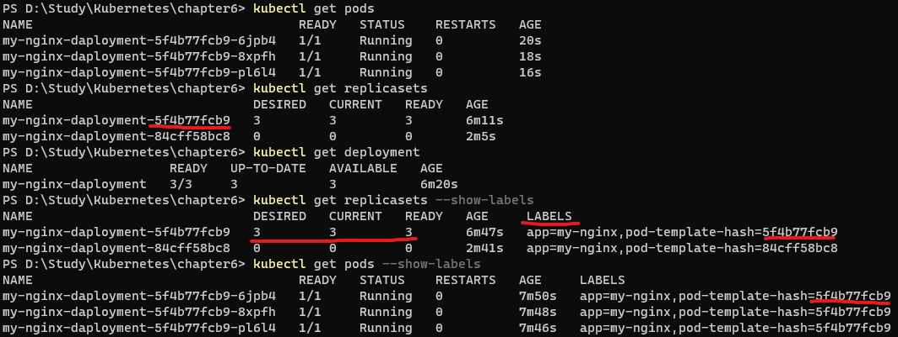

# Deployment : 레플리카셋 및 포드의 배포 관리

- 레플리카셋과 포드를 정의하는 오브젝트
- 레플리카셋만 사용해도 충분히 MSA 구조의 컨테이너를 구성할 수 있을 것 같지만, 실제 운영 환경에서 레플리카셋만으로 하는 경우는 거의 없음 대부분 디플로이먼트를 활용

## nginx 예제

```yaml
# deployment-nginx.yaml

apiVersion: apps/v1
kind: Deployment
metadata:
	name: mg-nginx-deployment
spec:
	replicas: 3
	selector:
		matchLabels:
			app: my-nginx
	template:
		metadata:
			name: my-nginx-pod
			labels:
				app: my-nginx
		spec:
			containers:
			- name: nginx
				image: nginx:1.10
				ports:
					containerPort: 80
```

- 레플리카 셋과 거의 동일하고 kind만 바뀜

```bash
kubectl apply -f deployment-nginx.yaml
```

- 생성 후 확인


- 레플리카셋의 이름을 보면 name 뒤에 hash 값이 하나 생성되서 붙는데 레플리카셋이나 레플리카셋이 생성한 Pod에 pod-template-hash={hash}라는 라벨이 추가됨.
- 이를 이용해서 다양한 배포 전략을 진행

## 배포전략 예시 (image update, rollback)

- 아래의 명령어를 통해서 현재 상태를 기록

```bash
kubectl apply -f deployment-nginx.yaml --record
```

- 현재 nginx의 이미지를 1.10 → 1.11 로 변경하고 —record 옵션을 통해서 기록

```bash
kubectl set image deployment my-nginx-deployment nginx=nginx:1.11 --record
```

- 변경하고 빠르게 —watch 옵션을 붙여서 pods의 상태를 계속 살펴보면 새로운 hash 가 붙은 pods가 생성되며 이전 hash가 붙은 pods은 삭제되는 모습을 볼 수 있음


- rollout history를 통해 여때 까지 기록된 revision들을 볼 수있음

```bash
kubectl rollout history deployment my-nginx-deployment
```


- rollout undo 명령어와 —to-revision={version} 옵션을 통해 버전 다운 가능

```bash
kubectl rollout undo deployment my-nginx-deployment --to-revision=1
```





- 생성된 팟, 레플리카셋의 해쉬라벨이 모두 같은것을 확인할 수 있고 rollout된 revision 2의 해쉬 오브젝트들은 desired=0, current=0인것을 볼 수 있음

- 이처럼 디플로이먼트는 여러 개의 레플리카셋을 관리하기 위한 상위 오브젝트
- 이를 이용한 다양한 배포 전략을 실현 가능

- 마무리
```bash
# 사용한 리소스 정리
kubectl delete deployment,pods,rs --all
```