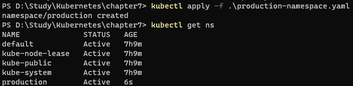

## 네임스페이스(Namespace) : 리소스를 논리적으로 구분하는 장벽

- 도커나 도커 스웜모드를 사용할 때에는 컨테이너를 논리적으로구분하는 방법이 없음
- docker run, docker-compose를 통해 컨테이너를 엄청 생성해도 docker ps를 통해 확인 가능
- 용도에 따라 컨테이너와 그에 관련된 리소스들을 구분 지어 관리할 수 있는, 일종의 논리적인 그룹이 있으면 좀 더 편하기에 제공되는 오브젝트
- 간단하게 포드, 레플리카셋, 디플로이먼트, 서비스 등과 같은 쿠버네티스 리소스들이 논리적으로 나누어져서 묶여 있는 하나의 가상 공간 또는 그룹

- `kubectl get ns` : 네임스페이스 확인

```bash
NAME              STATUS   AGE
default           Active   3h36m
kube-node-lease   Active   3h36m
kube-public       Active   3h36m
kube-system       Active   3h36m
```

- `kubectl get pods —namespace default`

```bash
NAME                                  READY   STATUS    RESTARTS   AGE
hostname-deployment-9664ffd7f-7p5sw   1/1     Running   0          3h34m
hostname-deployment-9664ffd7f-hpfxg   1/1     Running   0          3h34m
hostname-deployment-9664ffd7f-mp8vs   1/1     Running   0          3h34m
```

- `kubectl get pods -n kube-system`

```bash
NAME                                     READY   STATUS    RESTARTS       AGE
coredns-6d4b75cb6d-bq272                 1/1     Running   0              3h37m
coredns-6d4b75cb6d-ch25n                 1/1     Running   0              3h37m
etcd-docker-desktop                      1/1     Running   3              3h37m
kube-apiserver-docker-desktop            1/1     Running   3              3h37m
kube-controller-manager-docker-desktop   1/1     Running   3              3h37m
kube-proxy-dblcz                         1/1     Running   0              3h37m
kube-scheduler-docker-desktop            1/1     Running   3              3h37m
storage-provisioner                      1/1     Running   0              3h37m
vpnkit-controller                        1/1     Running   18 (97s ago)   3h37m
```

- `kubectl get service -n kube-system`

```bash
NAME       TYPE        CLUSTER-IP   EXTERNAL-IP   PORT(S)                  AGE
kube-dns   ClusterIP   10.96.0.10   <none>        53/UDP,53/TCP,9153/TCP   3h38m
```

- kube-system 네임스페이스는 쿠버네티스에 대한 충분한 이해 없이 안건드리는게 좋음.. (열려있는 서비스 하나 종료시켰다가 Pod이 실행안되고 Pending으로 묶여서 초기화한적이 한번있음..)

- 각 네임스페이스는 논리적으로만 구분된 것일 뿐, 물리적으로 격리된 것은 아니라는 점을 명시
    - 서로 다른 네임스페이스에서 생성된 포드가 같은 노드에 존재할 수도 있음

- 그렇다면 네임스페이스와 라벨의 차이점은 ?
    - 더욱 넓은 용도로 사용됨
    - ResourceQuota 오브젝트를 이용해 특정 네임스페이스에서 생성되는 포드의 자원 사용량을 제한한다거나, 애드미션 컨트롤러 기능을 이용해서 특정 네임스페이스에 생성되는 포드에 항상 사이드카 컨테이너를 붙이도록 설정 가능
    - 무엇보다도 쿠버네티스에서의 사용 목적에 따라 포드, 서비스 등의 리소스를 격리함으로써 편리하게 구분할 수 있다는 특징
        
        ```bash
        쿠버네티스의 네임스페이스와 리눅스의 네임스페이스는 다른 것.
        리눅스 네임스페이스는 컨테이너의 **격리된 공간**을 생성하기 위해 리눅스 커널의 자체 기능을 
        활용하는 것이며 일반적으로 네트워크, 마운트, 프로세스 네임스페이드 등을 의미함.
        쿠버네티스의 네임스페이스는 "격리" 보다는 "구분"에 가까움
        ```
        

```yaml
# production-namespace.yaml

apiVersion: v1
kind: Namespace
metadata:
  name: production
```

- `kubectl apply -f production-namespace.yaml`



- 특정 네임스페이스에 리소스 생성하기

```yaml
apiVersion: apps/v1
kind: Deployment
metadata:
  name: hostname-deployment-ns
  namespace: production
spec:
  replicas: 1
  selector:
    matchLabels:
      app: my-webserver
  template:
    metadata:
      name: my-webserver-pod
      labels:
        app: my-webserver
    spec:
      containers:
        - name: webserver
          image: alicek106/rr-test:echo-hostname
          ports:
            - containerPort: 80
---
apiVersion: v1
kind: Service
metadata:
  name: hostname-svc-clusterip-ns
  namespace: production
spec:
  ports:
    - name: web-port
      port: 8080
      targetPort: 80
  selector:
    app: my-webserver
  type: ClusterIP
```

- 하나의 YAML 파일에 - - - 를 이용해서 여러 개의 리소스를 정의해서 동시에 실행 가능

- 생성


- 이전에 클러스터 내부에서는 서비스 이름을 통해 포드에 접근했었는데, 이는 정확히 얘기하자면 “같은 네임스페이스”에 한정된 얘기임.


- default 네임스페이스에 생성하고 접근했기 때문에 접근이 되지 않는것
- 하지만 {서비스이름}.{네임스페이스이름}.svc 를 이용하면 다른 네임스페이스 서비스에 접근 가능


- 서비스의 DNS 이름에 대한 Fully Qualified Domain Name은 일반적으로 다음과 같음
    - `{서비스이름}.{네임스페이스이름}.svc.cluster.local`
    
- 삭제
    - `kubectl delete namespace production`
    - 네임스페이스를 삭제하면 현재 네임스페이스에 존재하는 모든 리소스가 같이 삭제되기 때문에 한번 확인하고 삭제하는 것이 좋음

## 네임스페이스에 종속적인 오브젝트와 독립적인 오브젝트

- 모든 리소스가 네임스페이스에 의해 구분되는 것은 아님
- 포드, 서비스, 레플리카셋, 디플로이먼트는 네임스페이스 단위로 구분
    - “오브젝트가 네임스페이스에 속한다.” (namespaced) 라고함
    - `kubectl api-resources —namespaced=true` 명령어로 종속적인 오브젝트 확인 가능

- 노드는 네임스페이스에 속하지 않는 대표적인 독립적 오브젝트
    - 노드는 저수준의 오브젝트이며 네임스페이스에 의해 구분되지 않음
    - `kubectl api-resources —namespaced=false` 명령어로 독립적인 오브젝트 확인 가능
- 물론 네임스페이스 자체도 독립적 오브젝트
- 굳이 다 외울 필요는 없음

- 기본적인 네임스페이스는 default 이지만 쿠버네티스 설정파일인 `kubeconfig` 파일을 수정함으로써 변경 가능