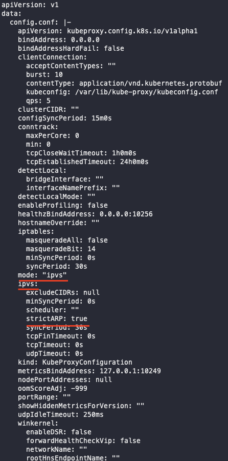

# MetalLB


- 온프레미스 환경에서 로드밸런서타입의 서비스를 배포 가능하게 해주는 도구

## 설치

```bash
# ipvs의 strictARP를 켜기 위한 작업

kubectl edit configmap -n kube-system kube-proxy

내용
kind: KubeProxyConfiguration
mode: "ipvs"
ipvs:
  strictARP: true
```



- 이렇게도 설정할 수 있음

```bash
# see what changes would be made, returns nonzero returncode if different
kubectl get configmap kube-proxy -n kube-system -o yaml | \
sed -e "s/strictARP: false/strictARP: true/" | \
kubectl diff -f - -n kube-system

# actually apply the changes, returns nonzero returncode on errors only
kubectl get configmap kube-proxy -n kube-system -o yaml | \
sed -e "s/strictARP: false/strictARP: true/" | \
kubectl apply -f - -n kube-system
```

- 설치

```bash
# 네임스페이스 추가
kubectl apply -f https://raw.githubusercontent.com/metallb/metallb/v0.12.1/manifests/namespace.yaml

# metallb 설치
kubectl apply -f https://raw.githubusercontent.com/metallb/metallb/v0.12.1/manifests/metallb.yaml
```

- 네임스페이스 확인 및 해당 네임스페이스의 실행중인 오브젝트 확인


- MetalLB 구성요소인 네임스페이스, 컨트롤러, 스피커가 잘 구성된 것을 확인했다
- MetalLB측에서 얘기하는 각 구성요소에 대한 설명은 다음과 같다.


- 해석을 한번 해보자면(잘하진 못하지만…)
- 클러스터에 `metallb-system`이라는 네임스페이스가 배포될 것이다
- 그 매니페스트안의 컴포넌트는 다음과같다
    - controller deployment : IP 주소 할당을 처리하는 클러스터-전체의 컨트롤러
    - speaker daemonset : 서비스에 도달할 수 있도록 선택한 프로토콜을 알려주는 구성요소 (아마 MetalLB의 layer2 나 BGP 같은 구성 프로토콜을 뜻하는거같다)
    - 컴포넌트가 기능하기 위한 RBAC 권한을 가진 컨트롤러와 스피커에 대한 서비스 계정
- 아직 정확하게 알기는 어렵지만 약간 인그레스 같은 개념으로 동작하는 것 같다
- 우리가 인그레스 룰을 만들고 그 위에 인그레스 컨트롤러(nginx, traefik 등)을 놓아서 룰을 읽어들여 룰에 맞게 배정 시키는 것처럼 저렇게 컨트롤러를 띄워 놓고 그 후에 configmap을 통해 metallb를 구성하는 느낌

이외에도 kustomize를 사용한 설치나 helm을 이용한 설치 등이 존재함

## MetalLB 구성

- MetalLB를 설치하고나서 구성을 하기 전까지 유휴 상태로 유지되는데 다양한 구성이 존재하는데 그중 가장 심플한 Layer2 모드를 예시로 구성해볼예정

- 현재 아이피를 확인해본 결과 163으로 공유기에 접속해있어서 이를 이용해서 스마트폰이나 다른 기기로 해당 아이피로 접근해볼예정


- 

```bash
# metallb-config.yaml

apiVersion: v1
kind: ConfigMap
metadata:
  namespace: metallb-system # metallb-system 네임스페이스에 생성
  name: config
data:
  config: |
    address-pools:
    - name: default
      protocol: layer2
      addresses:
      - 192.168.219.163-192.168.219.163 # 자신이 공개 가능한 IP로 설정
```

- 생성 : `kubectl apply -f metallb-config.yaml`

- 이제 MetalLB에 대한 설정이 완료가 됬으니 디플로이먼트와 로드밸런서를 하나씩 생성해서 접근해보자

- 디플로이먼트

```bash
# deployment.yaml

apiVersion: apps/v1
kind: Deployment
metadata:
  name: web-deploy

spec:
  replicas: 3
  selector:
    matchLabels:
      app: web
  template:
    metadata:
      name: web-pod
      labels:
        app: web

    spec:
      containers:
      - image: whatwant/node-web:1.0
        name: web
        ports:
        - name: http
          containerPort: 8080
          protocol: TCP
```

- 8080포트로 현재 접속한 파드의 네임을 호스팅하는 이미지를 3개의 레플리카로 생성한 디플로이먼트이다

- 서비스

```bash
# service.yaml

apiVersion: v1
kind: Service
metadata:
  name: web-svc

spec:
  ports:
  - name: http
    port: 80
    protocol: TCP
    targetPort: 8080
  selector:
    app: web
  type: LoadBalancer
```

- 80 포트로 접근하면 셀렉터에 선정된 라벨의 8080포트로 연결해주는 로드밸런서타입의 서비스를 하나 생성하였다

- 확인


- 디플로이먼트, 레플리카셋, 파드 3개가 순차적으로 잘 실행되고 있는 것을 확인했고, web-svc라는 로드밸런서 타입의 서비스가 잘 생성되면서 EXTERNAL-IP가 내가 설정해놓은 아이피(공유기에서 배정받은 아이피)로 잘 된것을 확인했다

- 이제 curl을 통해서 요청을 보내보자


- 3개의 파드로 고루고루 잘 접속하는걸 확인했다
- 그러면 이제 같은 공유기에 접속해있는 다른 기기(아이폰)로 접속해보자


- 잘된다 :)

- 물론 더 잘 사용하려면 이 앞에 인그레스도 붙이고 인증도 붙이고 MetalLB의 더 댜양한 구성을 공부해서 ConfigMap 구성을 해야하지만 현재는 이정도로 만족하고 나중에 aws나 gcp의 로드밸런서로 공부해보자
- 온프레미스에서 로드밸런서를 사용해서 구축할 일은 많이는 없을것같다

번외 : 노드포트와 로드밸런서의 차이

[Kubernetes NodePort vs LoadBalancer vs Ingress? When should I use what?](https://medium.com/google-cloud/kubernetes-nodeport-vs-loadbalancer-vs-ingress-when-should-i-use-what-922f010849e0)