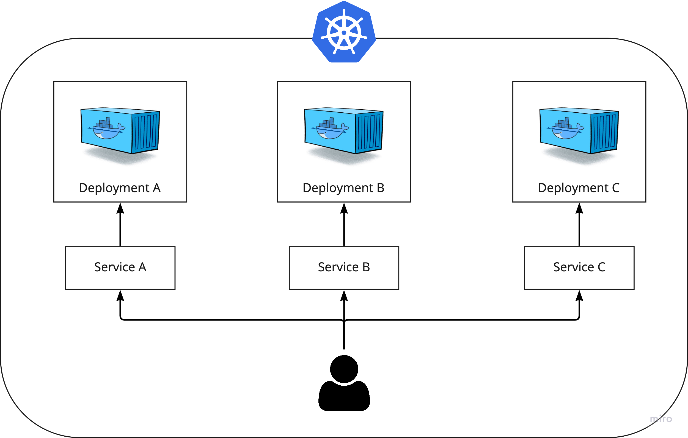

# 쿠버네티스 고급 기능 활용

- 다양한 오브젝트와 사용법에 대해 알아보았지만 그것만으로 실제 운용하기에는 부족한 부분이 많음
- 가상 호스트를 이용해 서비스 요청을 처리하거나, 영속적인 데이터 보관을 위한 외부 볼륨 연결 등이 필요함
- 또한, 여러 명의 개발자 또는 애플리케이션이 함께 사용하는 클러스터의 보안을 위해 반드시 권한을 관리해야하며, 특정 포드가 자원을 독차지하는 것을 막기 위해 리소스를 제한해야 함

- 쿠버네티스에서는 이러한 고급 기능들을 자체적으로 지원하고 있고 다른 플랫폼과 쉽게 연동할 수 있음
- 대표적으로 인그레스, 영구적 볼륨, 권한 관리, 자원 사용량 제한, 스케쥴링, 포드의 라이프사이클, 애플리케이션 업데이트 방법 등이 존재

## 인그레스 (Ingress)

- 인그레스는 일반적으로 외부에서 내부로 향하는 것을 지칭하는 단어
- 인그레스 트래픽은 외부에서 서버로 유입되는 트래픽을 뜻하고, 인그레스 네트워크는 트래픽을 처리하기 위한 네트워크를 의미

**기본적인 기능**

1. 외부 요청의 라우팅 : /exam1, /exam2 와 같이 특정 경로로 들어온 요청을 어떠한 서비스로 전달할지 정의하는 라우팅 규칙을 설정
2. 가상 호스트 기반의 요청 처리 : 같은 IP에 대해 다른 도메인 이름으로 요청이 도착했을 때, 어떻게 처리할 것인지 정의
3. SSL/TLS 보안 연결 처리 : 여러 개의 서비스로 요청을 라우팅할 때, 보안 연결을 위한 인증서를 쉽게 적용
- 위의 기능에 제한되는 것은 아니고 어떻게 활용하는지에 따라 다양한 기능이 됨

### 인그레스를 사용하는 이유

- 앞서 배운 서비스(NodePort, LoadBalancer)를 통해서 위의 기능들을 구현하는 것이 불가능하지는 않기 때문에 왜 써야하는지 필요성을 못 느낄수도 있음



인그레스를 사용하지 않은 모습

- 위와 같이 구성해서 3개의 디플로이먼트에 3개의 서비스를 각각 연결
- 위와 같이 구성했을 때의 단점은 서비스마다 세부적인 설정을 할 때 추가적인 복잡성이 발생하게 됨
- SSL/TLS 보안 연결, 접근 도메인 및 클라이언트 상태에 기반한 라우팅 등을 구현하려면 각각의 서비스와 디플로이먼트에 대해 일일히 설정을 해야 하기 때문
- 불가능한것은 아니지만 쿠버네티스가 제공하는 인그레스 오브젝트를 사용하면 URL 엔드포인트를 단 하나만 생성함으로써 이러한 번거로움을 쉽게 해결


Ingress Controller를 이용해서 구성

- 3개의 서비스에 대해 3개의 URL이 각각 존재하는 것이 아닌, 인그레스에 접근하기 위한 단 하나의 URL
- 인그레스에서 정의한 규칙에 따라 처리된 뒤 적절한 디플로이먼트 포드로 전달됨
- 이 과정에서 라우팅 정의나 보안 연결 등과 같은 세부 설정은 서비스와 디플로이먼트가 아닌 인그레스에 의해 수행됨

### 인그레스의 구조

```bash
# ingress-example.yaml

apiVersion: networking.k8s.io/v1
kind: Ingress
metadata:
  name: ingress-example
  annotations:
    nginx.ingress.kubernetes.io/rewrite-target: /
    kubernetes.io/ingress.class: "nginx"
spec:
  rules:
  - host: sseop.example.com
    http:
      paths:
      - path: /echo-hostname
        pathType: Prefix
        backend:
          service:
            name: hostname-service
            port:
              number: 80
```

- spec.rules.host: 해당 도메인 이름으로 접근하는 요청에 대해서 처리 규칙을 적용. 여러개도 가능
- spec.rules.http.paths.path: 해당 경로에 들어온 요청을 어느 서비스로 전달할 것인지 정의 위의 YAML에서는 /echo-hostname 이라는 경로의 요청을 backend에 정의된 서비스로 전달
- serviceName, servicePort : path로 들어온 요청이 전달될 서비스와 포트

```bash
🗒️ NOTE!
annotation 항목을 통해 인그레스의 추가적인 기능을 사용할 수 있으며, 위의 YAML 파일에서도 
두 가지 주석을 사용함. 추후 재 언급 예정
```


인그레스 생성 및 확인

- ingress-example 이라는 이름의 인그레스를 생성했지만, 아직 아무일도 일어나지 않음
- 단지 요청을 처리하는 규칙을 정의하는 선언적인 오브젝트일뿐 외부 요청을 받는 실제 서버가 아님
- 인그레스 컨트롤러라고 하는 특수한 서버에 적용해야만 그 규칙을 적용할 수 있음
- 실제로 외부 요청을 받아들이는 것은 인그레스 컨트롤러 서버이며, 이 서버가 인그레스 규칙을 로드해 사용함


인그레스 컨트롤러 구조

- 인그레스 컨트롤러 서버는 여러 종류가 있으며, 필요에 따라 하나를 골라서 사용하면 됨
- 대표적으로는 **Nginx 웹 서버 인그레스 컨트롤러**가 있음
- Nginx 인그레스 컨트롤러는 쿠버네티스에서 공식적으로 개발되고 있기 때문에 설치를 위한 YAML 파일을 공식 깃허브 저장소에서 직적 내려받을 수 있음
- `kubectl apply -f https://raw.githubusercontent.com/kubernetes/ingress-nginx/controller-v0.35.0/deploy/static/provider/aws/deploy.yaml`
    - 해당 파일을 바로 설치하려 했으나 apiVersion이 개발되면서 바뀐거같아 수정한 사항이 있음
    - 파일을 받아서 413라인에 있는 apiVersion을 다음과 같이 수정해야함

apiVersion: admissionregistration.k8s.io/v1beta1 → apiVersion: admissionregistration.k8s.io/v1


apiVersion 수정


nginx-ingress 생성


로컬에서의 오류…?

하지만 nginx-ingress가 제대로 생성이 안됨…
서비스가 로드밸런서 타입으로 생성된다는데 나는 왜 노드포드와 클러스터아이피로…
아마 설치되는 곳마다 다르게 생성되는듯..? 예제에서는 AWS에서 생성한것임…

- 원인을 찾아봅시다…
    
    오류를 찾다가 생각해보니 당연했던게 위에 설치 URL을 보면 nginx-ingress를 aws껄로 설치했다… ㅋㅋ
    → `deploy/static/provider/aws/deploy.yaml` ㅋㅋㅋ… 잘 보면서 진행합시다…
    
    실패하고 이곳저곳 이유를 찾던 중 다른 방법이 있어서 도전해보기로 했다.
    
    [Install `NGINX Ingress Controller` in Kubernetes](https://www.whatwant.com/entry/Install-NGINX-Ingress-Controller)
    
    해당 블로그에서는 baremetal 에서 제공하는 nginx ingress를 설치해서 진행했다 그걸 보고 따라 했슴니다.
    
    ```bash
    kubectl apply -f https://raw.githubusercontent.com/kubernetes/ingress-nginx/controller-v1.0.0/deploy/static/provider/baremetal/deploy.yaml
    ```
    
    - bare-metal 에서 제공하는 nginx ingress 설치하기
        - 다음에 뭐뭐가 있는지 차이가 뭔지 좀 알아봐야 할 것 같다.
        
        [Installation Guide - NGINX Ingress Controller](https://kubernetes.github.io/ingress-nginx/deploy/#bare-metal)
        
        - 이 방법으로 설치하게되면 NodePort 방식으로 설치가 된다.
        - LoadBalancer 방식은 다음에… 이전에 진행했던 온프레미스 로드밸런서 설치하는 걸로 한번 설치 이후 진행을 해봐야겠다.
        
    
    다음으로 위의 블로그에서는 네임스페이스를 만들고 그 스페이스 안에 디플로이먼트, 서비스, 인그레스를 생성해서 진행했는데 나는 제대로 진입이 안되서 ingress-nginx의 컨트롤러 로그를 분석한 결과 네임스페이스가 default인 곳으로 계속 서비스를 연결하려고 해서 안됬었다. 다음에 인그레스에서 네임스페이스를 설정하는 법이나 연결하는 법을 좀 더 배워야 겠다.
    
    먼저 디플로이먼트, 서비스, 인그레스를 각각 생성하겠다.
    
    ```bash
    # test-ingress/deployment.yaml
    
    apiVersion: apps/v1
    kind: Deployment
    metadata:
      name: web-deploy
    
    spec:
      replicas: 3
    
      selector:
        matchLabels:
          app: web
    
      template:
        metadata:
          name: web-pod
          labels:
            app: web
    
        spec:
          containers:
          - image: whatwant/node-web:1.0
            name: web
            ports:
            - containerPort: 8080
              protocol: TCP
    ```
    
    - 3개의 레플리카를 갖고 8080포트로 접속을 시도하면 접근한 컨테이너의 hostname이 뜨는 이미지를 띄웠다.
    
    ```bash
    # test-ingress/service.yaml
    
    apiVersion: v1
    kind: Service
    metadata:
      name: web-svc
    
    spec:
      ports:
      - port: 80
        targetPort: 8080
    
      selector:
        app: web
    ```
    
    - 80포트로 접근하면 8080으로 연결되도록 라벨링으로 연결했다.
    
    ```bash
    # test-ingress/ingress.yaml
    
    apiVersion: networking.k8s.io/v1
    kind: Ingress
    metadata:
      name: web-ingress
      annotations:
        nginx.ingress.kubernetes.io/rewrite-target: /
    		ingressclass.kubernetes.io/is-default-class: true
    spec:
      rules:
      - http:
          paths:
          - path: /test
            pathType: Prefix
            backend:
              service:
                name: web-svc
                port:
                  number: 80
    ```
    
    - /test URL로 접근하면 아까 만든 서비스의 80포트로 연결하도록 설정했다.
    - 어노테이션에서 두번째 줄이 없으면 에러가 나는데 아직 두줄의 어노테이션이 뜻하는 바는 잘 모르겠다…
    
    ```bash
    kubectl apply -f deployment.yaml
    kubectl apply -f service.yaml
    kubectl apply -f ingress.yaml
    ```
    
    - 별도의 네임스페이스 말고 전부 default 네임스페이스에 생성했다.
    
    `kubectl get svc -n ingress-nginx`
    
    - 위의 명령어를 통해서 맨처음 설치한 nginx가 어떤 포트로 서비스하는지 확인해보자
    
    
    
    - 30099 포트로 HTTP를 서비스하는걸 확인했다.
    
    - 접속결과 (새로고침 결과 로드밸런싱도 잘된다)
    
    
    
    
    

🗒️ NOTE! 

가장 간단하게 모든 요청을 전달하기

```yaml
# minimal-ingress.yaml

apiVersion: networking.k8s.io/v1beta1
kind: Ingress
metadata:
	name: minimal-ingress
spec:
	backend:
		service:
			name: hostname-service
			ports:
				number: 80
```


인그레스 컨트롤러의 전체 구성도

인그레스의 사용방법

1. 공식 깃허브에서 제공되는 YAML 파일을 통해서 인그레스 컨트롤러(Nginx)를 생성
2. Nginx 인그레스 컨트롤러를 외부로 노출하기 위한 서비스를 생성
3. 요청 처리 규칙을 정의하는 인그레스 오브젝트 생성
4. Nginx 인그레스 컨트롤러로 들어온 요청은 인그레스 규칙에 따라 적절한 서비스로 전달됨
- 3번의 과정에서 Nginx 인그레스 컨트롤러는 자동으로 인그레스 규칙을 로드해 Nginx 웹 서버에 적용함
- 이를 위해 Nginx 인그레스 컨트롤러는 항상 인그레스 리소스의 상태를 지켜보고 있으며 모든 네임스페이스의 인그레스 리소스를 읽어와 규칙을 적용함
- 하지만 요청을 실제 서비스로 전달하는 것은 아니며, Nginx 인그레스 컨트롤러는 서비스에 의해 생성된 엔드포인트로 요청을 직접 전달함
- 서비스의 ClusterIP가 아닌 엔드포인트의 실제 종착 지점들로 요청이 전달되는 셈. 이러한 동작을 쿠버네티스에서는 바이패스(bypass)라고 부름
- 서비스를 거치지 않고 포드로 직접 요청이 전달되기 때문

## 인그레스의 세부 기능 : annotation으로 설정

```yaml
# ingress-example.yaml

apiVersion: networking.k8s.io/v1beta1
kind: Ingress
metadata:
	name: ingress-example
	annotations:
		nginx.ingress.kubenetes.io/rewrite-target: /
		kubernetes.io.ingress.class: "nginx"
spec:
...
```

- 위에서 생성한 annotations를 확인해보면 `kubernetes.io.ingress.class` 는 해당 인그레스 규칙을 어떤 인그레스 컨트롤러에 적용할 것인지를 의미함
- 종종 쿠버네티스 클러스터 자체에서 기본적으로 사용하도록 설정된 인그레스 컨트롤러가 존재하는 경우가 있는데, 이 경우에는 어떤 인그레스 컨트롤러를 사용할 것인지 반드시 인그레스에 명시해주는 것이 좋음
    - 예를 들어 GKE에서 쿠버네티스를 사용하고 있다면 GKE에서 제공하는 인그레스 컨트롤러를 기본적으로 사용하도록 설정돼 있음
- `nginx.ingress.kubernetes.io/rewrite-target` 이 주석은 nginx 인그레스 컨트롤러에서만 사용할 수 있는 기능으로 인그레스에 정의된 경로로 들어오는 요청을 설정된 경로로 전달함
    - 만약 인그레스 컨트롤러로 /test 라고 접근을 하면 서비스에는 / 로 전달 됨

**rewrite-target 변경해보기**

- deployment

```yaml
apiVersion: apps/v1
kind: Deployment
metadata:
  name: hostname-deployment
spec:
  replicas: 3
  selector:
    matchLabels:
      app: webserver
  template:
    metadata:
      name: my-webserver
      labels:
        app: webserver
    spec:
      containers:
      - name: my-webserver
        image: alicek106/ingress-annotation-test:0.0
        ports:
        - containerPort: 5000
          name: flask-port
```

- service

```yaml
apiVersion: v1
kind: Service
metadata:
  name: hostname-service
spec:
  ports:
    - name: web-port
      port: 80
      targetPort: flask-port # 5000
  selector:
    app: webserver
  type: ClusterIP
```

- ingress

```yaml
apiVersion: networking.k8s.io/v1
kind: Ingress
metadata:
  name: ingress-example
  annotations:
    nginx.ingress.kubernetes.io/rewrite-target: /$2 # path의 (.*) 에서 획득한 경로로 전달합니다.
    kubernetes.io/ingress.class: "nginx"
spec:
  rules:
  - host: localhost # 원래는 접속할 도메인을 입력하는곳 현재는 도메인이 없기에 localhost
    http:
      paths:
      - path: /echo-hostname(/|$)(.*) # (.*) 을 통해 경로를 얻습니다.
        pathType: Prefix
        backend: 
          service: 
            name: hostname-service
            port: 
              number: 80
```

- 생성

```yaml
kubectl apply -f deployment.yaml
kubectl apply -f service.yaml
kubectl apply -f ingress.yaml
```

- ingress-nginx 의 포트 확인 HTTP(80)이 30099로 열림


- 디플로이먼트, 서비스 확인


접속되는 순서

