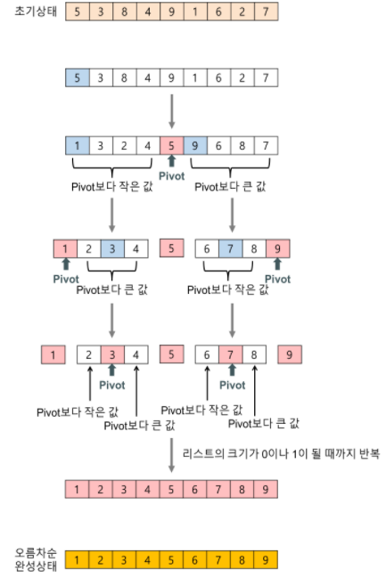

## **퀵 정렬**

\- **분할 정복**(divide and conquer) 방법을 사용함.

\- 불안정 정렬에 속하며 비교를 통한 정렬인 **비교 정렬**임.

\- 매우 빠른 속도를 자랑하지만 **최악의 수행속도가 O(n^2)**으로 느림.

\- 합병 정렬과 유사한 방법이기도 하지만 다른 점은 **비균등하게 분할**하여 conquer 함.

  (pivot의 인덱스를 기준으로 divide 하기 때문에)

## **정렬 방법**

<!-- [##_Image|kage@BRe32/btrs6666YyK/rp3osWuyuEYWF6eE6uaHjk/img.png|CDM|1.3|{"originWidth":433,"originHeight":658,"style":"alignCenter","caption":"출처 :&amp;amp;nbsp;https://gmlwjd9405.github.io/2018/05/10/algorithm-quick-sort.html"}_##] -->


1\. 기준이 될 한 요소를 무작위로 선택, 이를 **pivot** 이라 함.

2\. 왼쪽부터 **큰 값을 찾는 커서** 1개, 오른쪽부터 **작은 값을 찾는 커서** 1개 두 개를 생성. (오름차순 기준)

2\. pivot 값 보다 큰 값을 왼쪽부터 찾고 pivot 값보다 작은 값을 오른쪽부터 찾음. (오름차순 기준)

3\. 만약, 두 위치 모두 값을 찾았다면 두 값을 swap 함. (반복)

4\. 작은값, 큰값을 찾는 두 커서의 인덱스가 **겹치게 되면 종료**.

5\. 작은값쪽의 커서가 가르키는 값과 pivot의 위치의 값을 swap. (오름차순 기준)

6\. 변경된 **pivot 인덱스를 기준으로 배열을 두개로 나누어서** 다시 quick sort 실행.

7\. 나눈 배열의 왼쪽 커서가 오른쪽 커서랑 가르키는 인덱스가 같거나 크면 멈춤.

### **JAVA Code**

```
import java.io.BufferedReader;
import java.io.IOException;
import java.io.InputStreamReader;
import java.util.stream.IntStream;

public class QuickSort {
    public static int quickSort(int arr[], int left, int right) {
        int pivot = arr[left];

        int i = left, j = right;
        while (i<j) {
            while (arr[j] > pivot) {
                j--;
            }

            while(i < j && arr[i] <= pivot) {
                i++;
            }
            
            int tmp = arr[i];
            arr[i] = arr[j];
            arr[j] = tmp;
        }

        arr[left] = arr[i];
        arr[i] = pivot;

        return i;
    }

    public static void partitioning(int arr[], int left, int right) {
        if (left >= right) {
            return;
        }

        int pivotIdx = quickSort(arr, left, right);
        partitioning(arr, left, pivotIdx-1);
        partitioning(arr, pivotIdx + 1, right);
    }

    public static void main(String[] args) throws IOException {
        BufferedReader br = new BufferedReader(new InputStreamReader(System.in));
        int _loop = Integer.parseInt(br.readLine());

        int arr[] = new int[_loop];
        for (int i = 0; i < _loop; i++) {
            arr[i] = Integer.parseInt(br.readLine());
        }

        partitioning(arr, 0, arr.length-1);
        IntStream.range(0, arr.length).map(i -> arr[i]).forEach(System.out::print);
        System.out.println();
    }
}
```